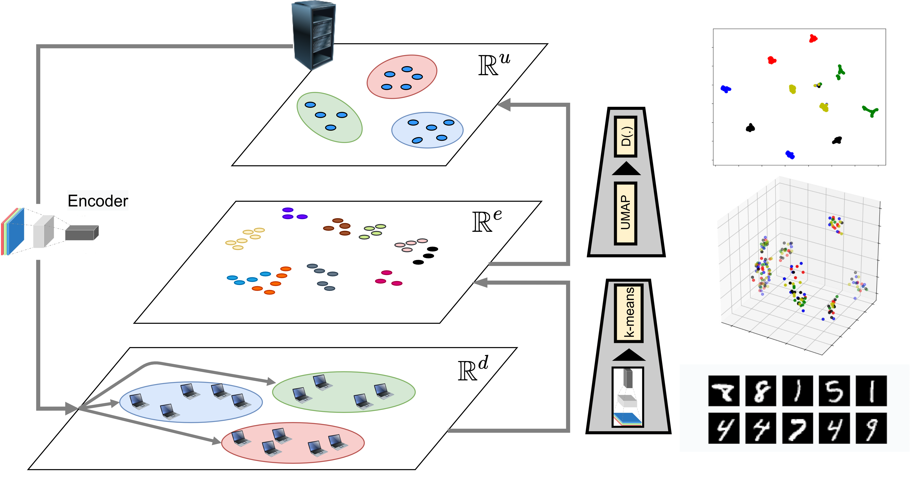
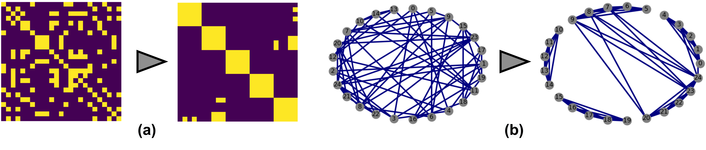
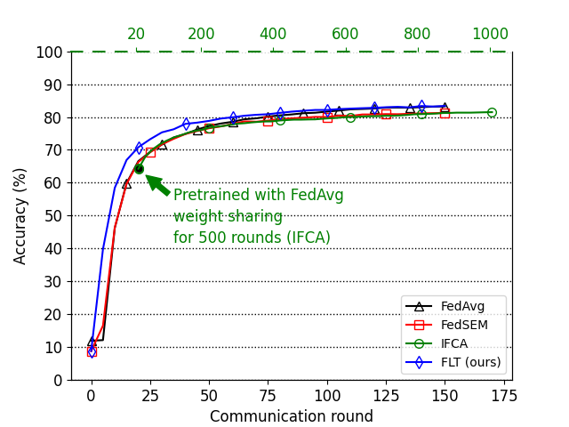
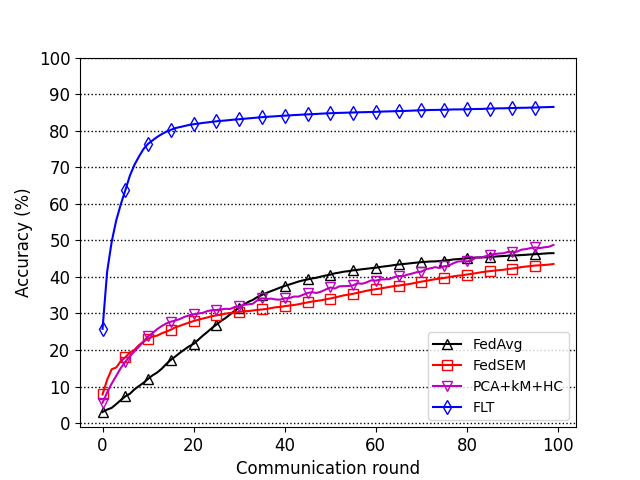
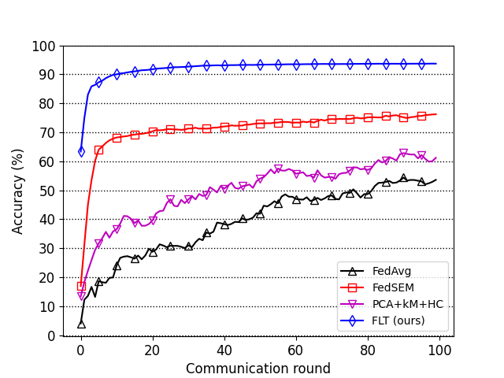

## Federated Learning with Taskonomy (FLT)
This is the official repository for [Federated Learning with Taskonomy for Non-IID Data](https://arxiv.org/abs/2103.15947) (Hadi Jamali-Rad, Mohammad Abdizadeh, Attila Szabó).

### Intro
Classical federated learning approaches incur significant performance degradation in the presence of non-IID client data. A possible direction to address this issue is forming clusters of clients with roughly IID data. Most solutions following this direction are iterative, and relatively slow and prone to convergence issues in discovering underlying cluster structure. We introduce federated learning with taskonomy (FLT) that generalizes this direction by learning the task-relatedness between clients for more efficient federated aggregation of heterogeneous data. In a one-off process, the server provides the clients with a pretrained encoder to compress their data into a latent representation, and transmit the signature of their data back to the server. The server then learns the task-relatedness among clients via manifold learning, and performs a generalization of federated averaging. FLT can flexibly handle generic client relatedness as well as decomposing it into (disjoint) cluster formation. We demonstrate that FLT not only outperforms the existing state-of-the-art baselines but also offers improved fairness across clients.

### Architecture


We consider three abstraction levels: 
- **data level**,
- **encoder level**, where a contractive latent space representation of client data is extracted in an unsupervised fashion
- **manifold approximation level** with UMAP

The encoder is provided by the server to the clients. This allows them to apply one-shot contractive encoding on their local data, followed by k-means on the outcome and return the results to the server. At server side, UMAP is applied to approximate the arriving clients embeddings. 
This is followed by applying a distance threshold to determine client dependencies and form an adjacency matrix or a client (task) relatedness graph. In case forming disjoint clusters is of interest, we then use hierarchical clustering [1] to efficiently reorder the adjacency matrix (or corresponding client relatedness graph) into disjoint clusters. We show a) the adjacency matrix and b) the corresponding client relatedness graph (both reordered on the right) in the following figure:



### Results

#### Scenario 3
We import the standard FEMNIST dataset of LEAF and construct a network of 200 clients according to train and test data distributions defined in [2]. In the following table, we present performance results for both MLP and CNN networks. All the MLP experiments are run for T=1000 communication rounds, and those for CNN are run for only T=100 rounds, except for IFCA which is run for 1500 rounds for both MLP and CNN. 

| Scenario 3 | MLP | CNN|
| :-----| :---: | :---: |
| FedAvg [3]| 72.76 |81.64 | 
| IFCA [4] | 61.24 | 81.47| 
| FedSem [5]|72.45 | 79.99| 
| FLT (ours) | **74.11**|**82.14** | 

Convergence graph of test accuracies for Scenario 3, FEMNIST, M=200 (left: MLP, right, CNN). On the right for CNN, note the different range of communication rounds on the top horizontal axis associated with IFCA.



#### Scenario 4 
This experiment presents a large-scale federated learning setting with structured non-IIDness involving both quantity and label distribution skews. The test accuracies at the last communication round T=100 are summarized in the following table.

| Scenario 4 | MLP | CNN|
| :-----| :---: | :---: |
| FedAvg [3]|46.50 | 53.58| 
| FedSem [5]|43.53 | 76.22 | 
| FLT (ours) | **86.51**| **93.69** | 

Convergence graph of test accuracies for Scenario 4, Structured Non-IID FEMNIST, C=10 for MLP (left) and CNN (right) models.



### Requirements
1. Go to the root directory ```cd FLT```
2. Create an environment ```conda create -n flt python=3.7```
3. Activate the environment ```conda activate flt```
4. Install the requirements ```pip install -r requirements.txt```

### Run the experiments
The main script should be run from the right directory with the corresponding config file path as follows

```
cd src
python main.py --config <path-to-config-file>
```
For example, to run experiment using the config ```FLT/configs/scenario_3/femnist_fedavg.yaml```
```
cd src
python main.py --config ../configs/scenario_3/femnist_fedavg.yaml
```

Note: The path for the data files, ouputput files and other hyperparameters can be modified from within the config file.

<!-- The script loads the configuration files to run directly under the ```FLT/configs/``` folder in alphabetical order. Please move the config files based on the desired experiment. The default settings are defined in ```FLT/base_fed_learning/utils/options.py``` -->

We present the configs for Scenario 3:
 - ```FLT/configs/scenario_3/femnist_fedavg.yaml```
 - ```FLT/configs/scenario_3/femnist_kmeans.yaml```
 - ```FLT/configs/scenario_3/femnist_fedsem.yaml```
 - ```FLT/configs/scenario_3/femnist_flt_enc2.yaml```
 
Note: for runs with IFCA we used the original implementation [4]

and Scenario  4:
 - ```FLT/configs/scenario_4/femnist_fedavg.yaml```
 - ```FLT/configs/scenario_4/femnist_kmeans.yaml```
 - ```FLT/configs/scenario_4/femnist_fedsem.yaml```
 - ```FLT/configs/scenario_4/femnist_flt_enc2.yaml```

Once the training is finished, accuracies and variances are generated in ```FLT/outputs/<exp_name>/results.csv```

### Contact
Corresponding author: Hadi Jamali-Rad (h.jamali.rad {at} gmail {dot} com, h.jamalirad {at} tudelft {dot} nl)

**References**

[1] Modern hierarchical, agglomerative clustering algorithms, D. Müllner, 2011.

[2] LEAF: A Benchmark for Federated Settings, S. Caldas, S. M. K. Duddu, P. Wu, T. Li, J. Konecny, H. B. McMahan, V. Smith, and A. Talwalkar, 2018

[3] Communication-efficient learning of deepnetworks from decentralized data, B. McMahan, E. Moore, D. Ramage, S. Hampson, and B. A. y Arcas, 2017

[4] An efficient framework for clustered federated learning, A. Gosh, J. Chung, D. Yin, and K. Ramchandran, 2020.

[5] Multi-center federated learning, M. Xie, G. Long, T. Shen, T. Zhou, X. Wang, and J. Jiang, 2020.

<!-- [3] Heterogeneity for the Win: Communication-Efficient Federated Clustering, D. K. Dennis and V. Smith, 2020. 
